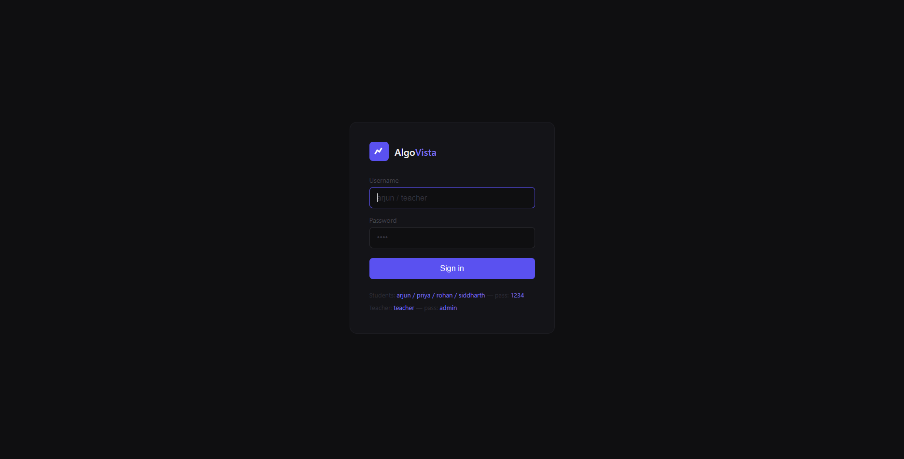
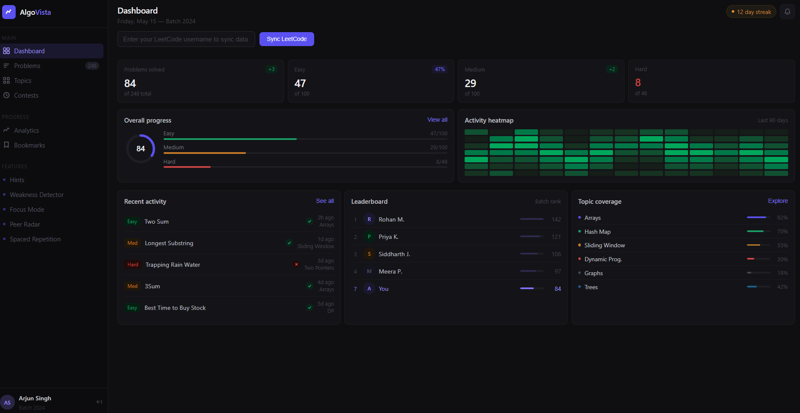
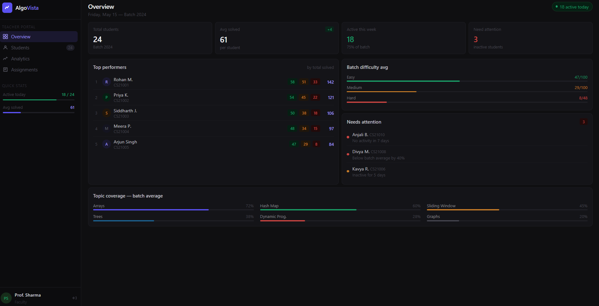

# AlgoVista

AlgoVista is a full-stack DSA learning and coding analytics platform designed for students and educators.

The platform helps learners improve Data Structures & Algorithms (DSA) preparation through topic-wise recommendations, coding analytics, LeetCode performance tracking, and structured progress monitoring.

## Live Demo

https://algovista-one.vercel.app

---
## Project Screenshots

### Login Page



### Student Dashboard



### Teacher Dashboard


## Highlights

- Student & Teacher Portal
- LeetCode Integration
- Topic-wise DSA Tracking
- Progress Analytics
- Weakness Detection
- Activity Heatmap
- Focus Mode
- Spaced Repetition

## Overview

Common challenges in DSA preparation include:

- Finding the right DSA problems
- Tracking coding progress effectively
- Identifying weak topics
- Maintaining consistency
- Getting structured learning insights

AlgoVista addresses these problems through analytics, progress tracking, and intelligent DSA recommendations.

---

## Features

### Student Portal

- Student login system
- LeetCode username synchronization
- Topic-wise DSA recommendations
- Coding performance tracking
- Activity heatmap
- Weakness detection
- Focus mode
- Spaced repetition learning
- Progress analytics

### Teacher Portal

- Separate teacher dashboard
- Student monitoring
- Progress insights
- Performance analytics

---

## Project Preview

### Login Interface
(Add Screenshot Here)

### Student Dashboard
(Add Screenshot Here)

### Analytics Section
(Add Screenshot Here)

---

## Tech Stack

### Frontend
- React.js
- Vite
- CSS

### Backend
- Node.js
- Express.js

### Database & Services
- Firebase Firestore

### Deployment
- Vercel

---

## Project Structure

```bash
AlgoVista/
│── api/
│── src/
│   ├── components/
│   ├── context/
│   ├── pages/
│── server.js
│── firebase.js
│── package.json
│── vite.config.js
```

---

## Core Modules

- Dashboard Analytics
- DSA Topic Recommendations
- LeetCode Integration
- Weakness Detection
- Focus Mode
- Peer Radar
- Spaced Repetition
- Progress Tracking

---

## Future Improvements

Planned enhancements:

- Secure authentication system
- New user registration
- Advanced analytics
- AI-based problem recommendations
- Gamification features
- Smart study planning
- Better security and database optimization

---

## Developer

Harsh Kumar  
B.E. Computer Science Engineering  
Chandigarh University

---

## Note

This project is actively being improved with additional features and system enhancements.
